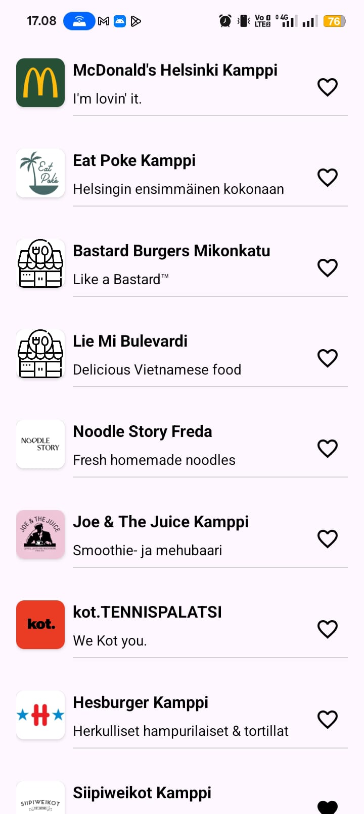
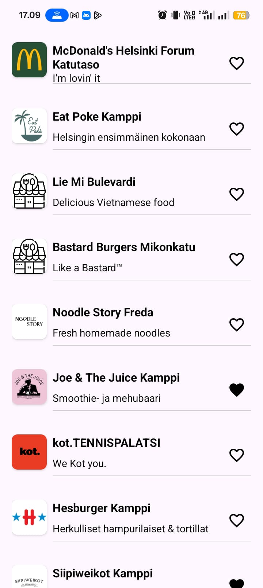
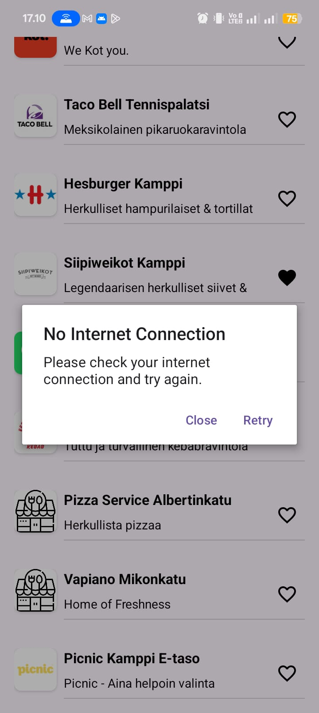

# 📱 Helsinki Restaurant Finder (Wolt-Assignment-Jan2025)
A simple Android app built in Kotlin for a preliminary mobile engineering assignment. It displays a list of restaurants near a user’s simulated location in the Helsinki city center, updating every 10 seconds.

This app was originally submitted as part of an internship assignment, and has been included here to showcase mobile development skills using Kotlin, Jetpack components, and real-world API integration.
***
## 🚀 Features
  - 🔄 Live location simulation: Updates user coordinates every 10 seconds from a predefined list.
  
  - 📍 Nearby venues: Fetches up to 15 venues per location from Wolt’s restaurant API.
  
  - 💖 Favourites: Mark/unmark venues as favourites. Persisted across app restarts.
  
  - 🎞️ Smooth transitions: Venue list updates with clean animations.
  
  - ♻️ Location loop: After the final coordinate, the app restarts from the beginning.
***
## 📸 Screenshots
  

  
  
  

***
## 🧠 What I Learned
  - Working with real-world APIs and parsing complex JSON responses
  
  - Persisting UI state across restarts
  
  - Building smooth UI transitions with recyclerview updates
  
  - Clean architecture and modular code organization

***
## 📝 License
This project is for educational and portfolio purposes only. API © Wolt, used under fair-use.
